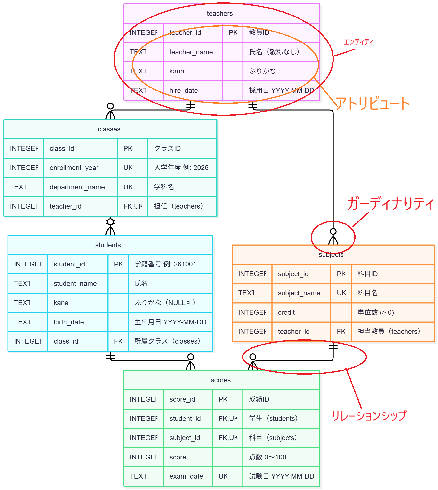
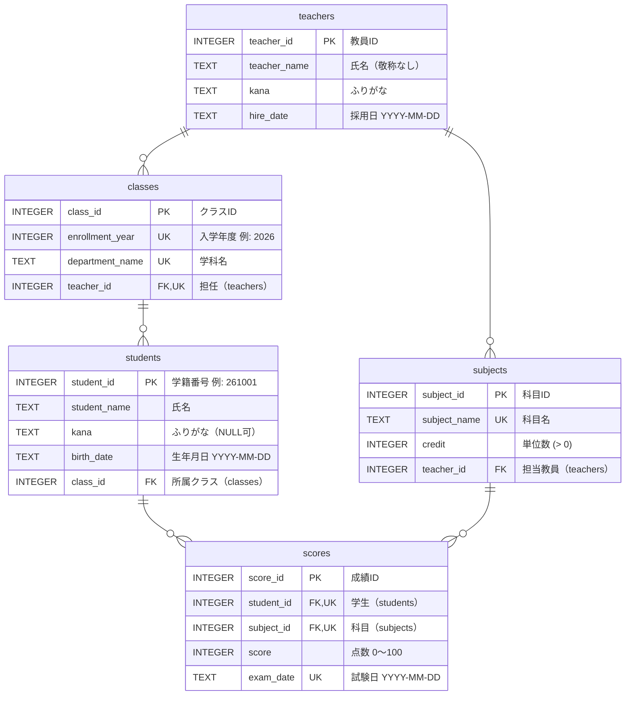

## ER図

### 1. ER図とは

**ER図（Entity Relationship Diagram）** は、データベースの**設計図**です。
「どんな表（テーブル）があって、表と表がどうつながっているか」を1枚の図で表します。

- システムを作るとき、データベースを作る前にER図を描いて、表の分け方やつなぎ方を決める
- Webサイトや業務システムの設計では、ほぼ必ず作られる、データベース設計の基本となる図

前の資料で「先生・クラス・学生」の表を分けて、番号でつないだものを図にすると、次のようになります。

### 2. ER図を作っている4つの部品

| 部品 | 意味 | データベースでいうと |
| --- | --- | --- |
| **エンティティ** | データのまとまり（箱） | テーブル（例：`teachers`） |
| **アトリビュート** | エンティティが持つ項目 | 列（例：`teacher_name`） |
| **リレーションシップ** | エンティティ同士のつながり（線） | 外部キーによるつながり |
| **カーディナリティ** | 線の端の記号。「1対多」など、何件と何件がつながるか | 1件に対して何件つながるか |

下の図は、この授業で使う学生管理システムのER図です。4つの部品に印を付けています。

### 3. カーディナリティ（線の端の記号）の読み方

線の端の記号は、**鳥の足**のような形をしています。この書き方を **IE記法** といい、ER図の代表的な書き方の一つです。

| 線の端の形 | Mermaidでの書き方 | 意味 |
| --- | --- | --- |
| 縦線2本 | `\|\|` | ちょうど1件 |
| ○と縦線 | `o\|` / `\|o` | 0件か1件 |
| ○と鳥の足 | `o{` / `}o` | 0件以上（多） |
| 縦線と鳥の足 | `\|{` / `}\|` | 1件以上（多） |

例：`teachers ||--o{ classes`

- `teachers` 側が `||` → クラス1つから見ると、担任の先生は**ちょうど1人**
- `classes` 側が `o{` → 先生1人から見ると、担任するクラスは**0個以上**（担任を持たない先生もいる）

参考：https://qiita.com/ramuneru/items/32fbf3032b625f71b69d

### 4. キーの記号

| 記号 | 意味 | 説明 |
| --- | --- | --- |
| **PK** | 主キー（Primary Key） | 1行を見分けるための列。重複もNULLも入れられない |
| **FK** | 外部キー（Foreign Key） | ほかの表の主キーを指す列。表と表をつなぐ役割 |
| **UK** | 一意制約（Unique Key） | 値が重複してはいけない列 |

### 5. 学生管理システムのER図（全体）

`sql/00_create_and_seed.sql` で作成するテーブルのER図です。上の画像と同じ内容を、Mermaidで書いています。

#### 各テーブルの役割

| テーブル | 何のデータか | つながり |
| --- | --- | --- |
| `teachers` | 先生 | クラスの担任になる。科目を担当する |
| `classes` | クラス（入学年度 × 学科） | 担任の先生が1人いる。学生が所属する |
| `students` | 学生 | 1つのクラスに所属する |
| `subjects` | 科目 | 担当の先生が1人いる |
| `scores` | 成績 | 「どの学生の」「どの科目の」点数かを持つ |

### 6. 補足

- **UK は、複数の列を組み合わせた一意制約になっているものがあります。**
  図では組み合わせを表せないため、実際の制約を以下に示します。
  - `classes`：`(enrollment_year, department_name)` … 同じ入学年度に、同じ学科のクラスは1つだけ
  - `classes`：`(enrollment_year, teacher_id)` … 同じ入学年度に、1人の先生が担任できるのは1クラスだけ
  - `scores`：`(student_id, subject_id, exam_date)` … 同じ試験の成績を二重に登録させない
  - `subjects.subject_name` だけは、1列だけの一意制約
- **`scores` は、`students` と `subjects` の「多対多」をつなぐ中間テーブルです。**
  1人の学生は複数の科目を受け、1つの科目は複数の学生が受けます。この「多対多」は直接つなげないので、間に `scores` を置いて「1対多」2本に分けています。
- **線の「多」の側がすべて「0件以上（`o{`）」なのは、次のようなデータがあるためです。**
  - 担任を持たない先生がいる
  - 学生がいないクラスがある
  - 未受験の科目がある

---
